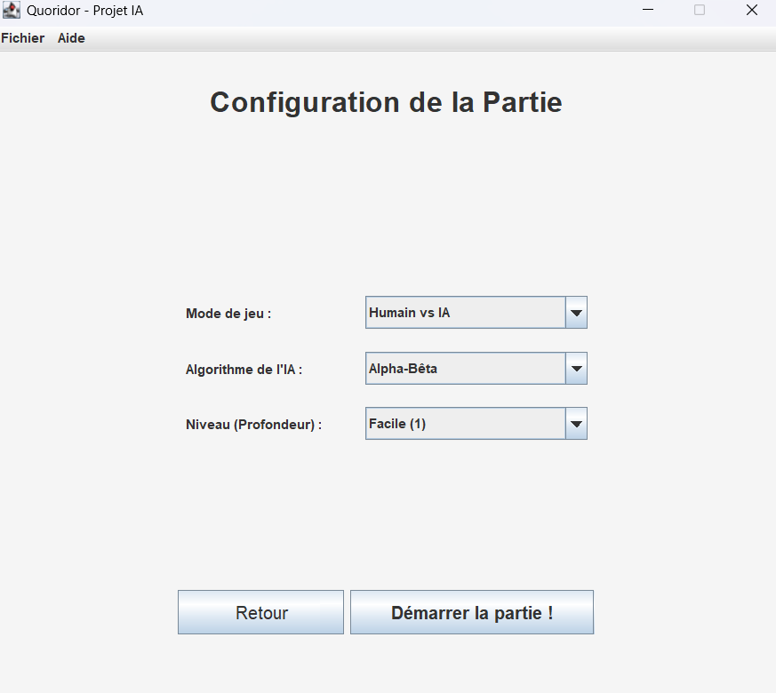
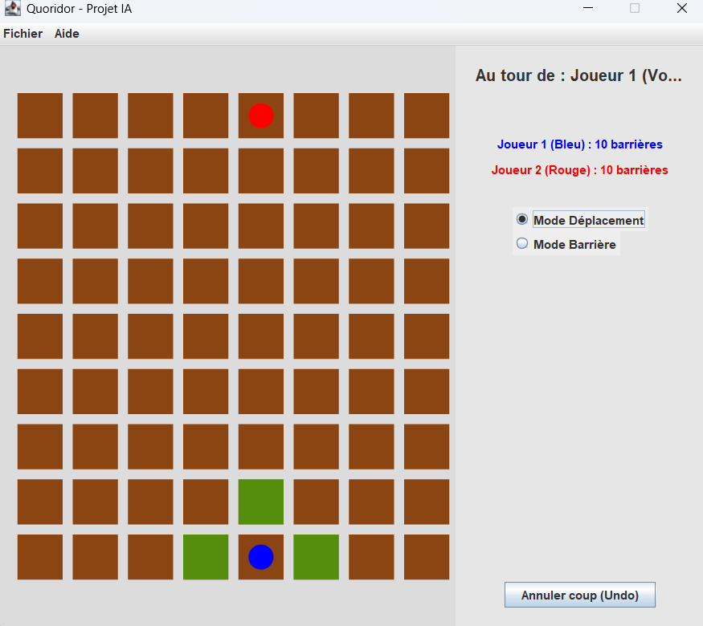

# Quoridor - Projet IA

Ce projet implémente le jeu de plateau de stratégie complexe **Quoridor** selon 
les règles officielles, couplé à une Intelligence Artificielle (Alpha-Bêta, 
Négamax, SSS*) et géré par une architecture **Java 21 / Spring Boot** 
(Injection de dépendances) ainsi qu'une interface **Swing**.

---

## Technologies Utilisées

| Technologie | Version | Rôle |
|---|---|---|
| Java | 21 | Langage principal |
| Spring Boot | 3.2.4 | Injection de dépendances (IoC) |
| Swing (Java Desktop) | JDK intégré | Interface graphique |
| JUnit 5 | 5.x | Tests unitaires |
| Apache Maven | 3.9+ | Build & gestion des dépendances |

---

##  Prérequis

Avant de lancer le projet, assurez-vous d'avoir installé :

- **Java 21+** → [Télécharger OpenJDK](https://adoptium.net/)
- **Apache Maven 3.9+** → [Télécharger Maven](https://maven.apache.org/download.cgi)

Vérifiez vos installations avec :
```bash
java -version
mvn -version
```

---

## Installation et Lancement

### 1. Cloner le projet
```bash
git clone https://github.com/votre-repo/quoridor.git
cd quoridor
```

### 2. Lancer le jeu (interface graphique)
```bash
mvn spring-boot:run
```
> Une fenêtre graphique Swing s'ouvre automatiquement.  
> Ne pas lancer depuis un terminal sans affichage graphique (serveur SSH sans X11).

### 3. Exécuter les tests unitaires
```bash
mvn clean test
```
> Lance tous les tests JUnit 5 : logique des règles, BFS, IA (Alpha-Bêta, Zobrist...).

### 4. Générer le `.jar` exécutable
```bash
mvn clean package
```
> Le fichier généré se trouve dans `target/quoridor-1.0.0-SNAPSHOT.jar`.  
> Lançable sur n'importe quelle machine Java 21 sans Maven :
> ```bash
> java -jar target/quoridor-1.0.0-SNAPSHOT.jar
> ```

---

## Fonctionnalités

- **Mode Multijoueurs local** (Humain vs Humain)
- **Mode Solitaire** (Humain vs IA) avec choix de l'algorithme et du niveau de difficulté
  - Niveau Facile (profondeur 1), Moyen (profondeur 3), Difficile (profondeur 5)
  - Algorithmes disponibles : Alpha-Bêta, Négαβ, SSS*
- **Mode Spectateur** (IA vs IA) — observation des comportements algorithmiques
- **Module Règles** interactif et illustré
- **Vue Replay / Exemples** — revisionnez une partie coup par coup
- **Undo** — annulation synchronisée du tour entier (votre coup + réponse IA)

---

## Structure du Projet

```
├── src
│   ├── main
│   │   └── java
│   │       └── com
│   │           └── quoridor
│   │               ├── ai
│   │               │   ├── AIService.java
│   │               │   ├── AlphaBetaService.java
│   │               │   ├── HeuristiqueService.java
│   │               │   ├── NegAlphaBetaService.java
│   │               │   ├── SSSStarService.java
│   │               │   ├── TranspositionTable.java
│   │               │   └── ZobristHasher.java
│   │               ├── model
│   │               │   ├── Barriere.java
│   │               │   ├── EtatJeu.java
│   │               │   ├── Joueur.java
│   │               │   ├── Pion.java
│   │               │   └── Plateau.java
│   │               ├── service
│   │               │   ├── GameService.java
│   │               │   ├── PathService.java
│   │               │   └── RegleService.java
│   │               ├── ui
│   │               │   ├── ExemplesPanel.java
│   │               │   ├── InfoPanel.java
│   │               │   ├── MainFrame.java
│   │               │   ├── MenuPanel.java
│   │               │   ├── NiveauPanel.java
│   │               │   ├── PlateauPanel.java
│   │               │   └── ReglesPanel.java
│   │               ├── util
│   │               │   └── Constantes.java
│   │               └── QuoridorApplication.java
│   └── test
│       └── java
│           └── com
│               └── quoridor
│                   ├── ai
│                   │   ├── AlphaBetaServiceTest.java
│                   │   ├── TranspositionTableTest.java
│                   │   └── ZobristHasherTest.java
│                   └── service
│                       ├── PathServiceTest.java
│                       └── RegleServiceTest.java
├── RAPPORT.md
├── README.md
└── pom.xml
```

## Captures d'écran

### Configuration de la Partie

> Sélection du mode de jeu, de l'algorithme IA et du niveau de difficulté.

### Plateau de Jeu

> Plateau 9x9 en cours de partie — cases accessibles en vert, 
> pion Joueur 1 (Bleu) en bas, pion Joueur 2 (Rouge) en haut.

---

## Rapport de Projet

Un rapport de projet complet et détaillé (rédigé en LaTeX) est disponible dans le dossier `doc/`.

Ce document explicite notamment :
- L'architecture globale du jeu (Modèle-Vue-Contrôleur) et les technologies employées (Java 21, Spring Boot, Swing).
- La modélisation des entités `Plateau`, `Pion` et `Barriere` agrémentée de snippets de code.
- Les principes et algorithmes de l'Intelligence Artificielle intégrée (Alpha-Bêta, SSS*).
- Les mécanismes d'optimisation (Hachage de Zobrist, Tables de Transposition, évaluation heuristique, gestion des plus courts chemins BFS).

Pour consulter ou recompiler le rapport papier, référez-vous au fichier principal :
- `doc/rapport.tex`

**Auteurs du projet :** Mouhoubi Leiticia, Kherbachi Rima, Brahimi Thiziri, Cherifi Yasmine.
**Enseignante / Encadrante :** Selmi Carla.